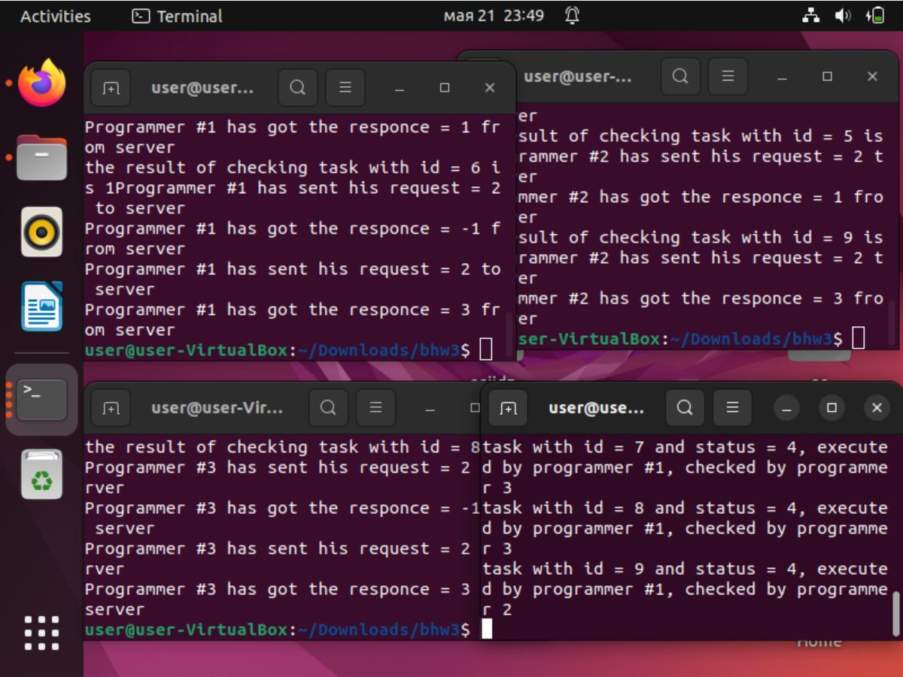

Багрянский Константин Дмитриевич

БПИ218

Вариант 21

```
Задача о программистах. В отделе работают три программиста.
Каждый программист пишет свою программу и отдает ее на
проверку другому случайному программисту. 
Программист переключается на проверку чужой программы, когда его собственная
уже написана и передана на проверку. По завершении проверки,
программист возвращает программу с результатом (формируемым
случайно по любому из выбранных Вами законов): программа написана правильно или неправильно. 
Программист спит, если отправил свою программу и не проверяет чужую программу. 
Программист просыпается, когда получает заключение от другого программиста. 
Если программа признана правильной, программист пишет
другую программу, если программа признана неправильной,
программист исправляет ее и отправляет на проверку тому же программисту, который ее проверял. 
К исправлению своей программы
он приступает, завершив проверку чужой программы. Проверки и
коррекции одной программы могут проходить многократно (правильность программы задается случайным образом). При наличии
в очереди проверяемых программ и приходе заключения о неправильной своей программы программист может выбирать любую из
возможных работ. Создать приложение, моделирующее работу программистов. Каждый программист задается отдельным процессом.
```

Сценарий решаемой задачи:
При запуске server создаётся сервер, через который будут общаться проограмисты
При запуске client будет создаваться програмист, который напишет задачу и
отправит другому програмисту через сервер на проверку.
Програмист, который получит задачу на проверку проверяет её и отправялет програмисту,
который отправил ему задачу вердикт. Если вердикт был неудовлетворительным,
то програмист переписывает задачу и отправляет её на проверку тому же програмисту

Особенности решений на каждую оценку
на 4-5 папка /part1




